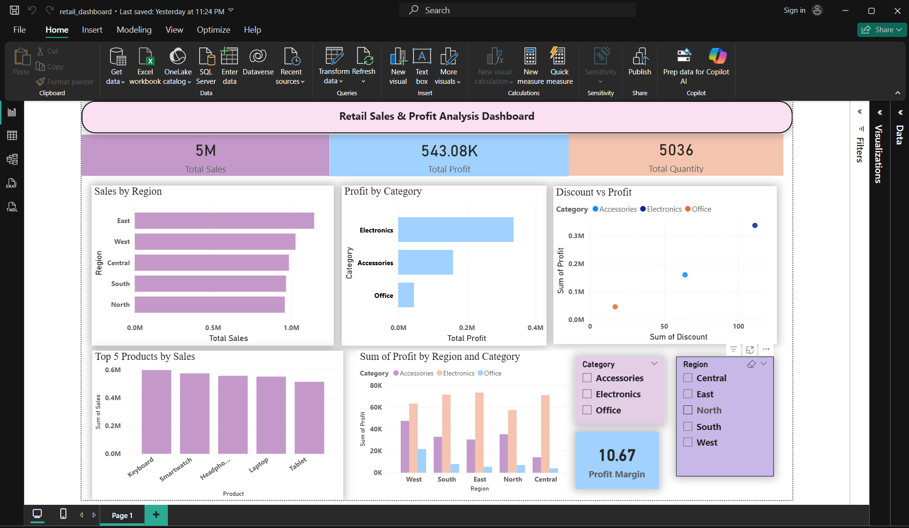

Retail Analytics: End-to-End Data Engineering & BI Dashboard
This repository features a complete data science workflow, transforming "messy" retail transaction data into actionable business intelligence. The project encompasses automated data cleaning, statistical EDA, and an interactive Power BI dashboard.

🚀 Project Overview
Retail businesses often struggle with data silos and inconsistent formatting. This project demonstrates a robust pipeline to:
Sanitize raw CSV data using localized imputation and type-casting.
Analyze profitability drivers and customer behavior using Python.
Visualize high-level KPIs and regional performance for executive decision-making.

🛠 Tech Stack
Data Processing: Python (Pandas, NumPy)
Statistical Visualization: Seaborn, Matplotlib
Business Intelligence: Microsoft Power BI
Environment: Jupyter Notebook / Anaconda

📂 Project Structure
```
Plaintext
Retail-Sales-Analysis/
│
├── data/
│   ├── messy_retail_dataset.csv     # Original raw data with inconsistencies
│   └── clean_retail_dataset.csv     # Exported after messeyretail.ipynb
│
├── notebooks/
│   ├── messeyretail.ipynb           # Data Cleaning & Preprocessing pipeline
│   └── cleanretaiEDA.ipynb          # Exploratory Data Analysis & Viz
│
├── EDA Plots/                       # Exported statistical visualizations
│   ├── sales_distribution.png
│   ├── profit_vs_discount.png
│   └── category_performance.png
│
├── dashboard/
│   └── retail_dashboard.pbix        # Interactive Power BI Dashboard
│
├── requirements.txt                 # Project dependencies
└── README.md

```
⚙️ Workflow & Methodology

1. Data Engineering Pipeline
The cleaning process in messeyretail.ipynb handles common real-world data issues:
Regional Imputation: Missing Country values were filled using the mode of the specific Region they belonged to, ensuring geographical accuracy.
Inconsistency Correction: Standardized ShippingMode entries (e.g., converting "EXPRESS" to "Express") and handled "Unknown" string placeholders.
Schema Validation: Ensured all dates followed a standardized format and numerical columns were cast to appropriate float types for calculation.

2. Exploratory Data Analysis (EDA)
Key analytical insights addressed in cleanretaiEDA.ipynb:
The Discount Impact: Visualizing the inverse relationship between high discount rates and net profit margins using scatter plots and correlation matrices.
Customer Loyalty: Identifying the "Top 5 High-Frequency Customers" and calculating "Buyer Recency" to track engagement levels.
Category Analysis: Segmenting sales volume vs. profit margin to identify "loss leaders" versus "cash cows."

📊 Visual Analysis Summary
The following plots are available in the EDA Plots folder:
Sales Distribution: A histogram showcasing the spread of transaction values across the dataset.
Profit vs. Discount: A regression plot highlighting how aggressive discounting impacts the bottom line.
Category Performance: A bar chart comparing total sales and net profit across different product segments.

📈 Power BI Dashboard
The interactive dashboard provides a 360-degree view of the business:
KPI Cards: Real-time tracking of Total Sales, Profit, and Quantity.
Map Visuals: Regional sales distribution to identify underperforming markets.
Drill-Downs: Filter by ShippingMode or Category to see specific performance metrics.


🛠 Installation & Usage
Clone the Repo:

Bash
git clone https://github.com/itsAtharv7/Retail-Sales-EDA.git
Setup Environment:

Bash
pip install -r requirements.txt
Run Pipeline:
Execute the notebooks in the notebooks/ folder sequentially to see the data transformation and plot generation.

👤 Author
Atharv Kathar AI Engineer Intern at Rubixe AI [https://www.linkedin.com/in/atharv-kathar] 
